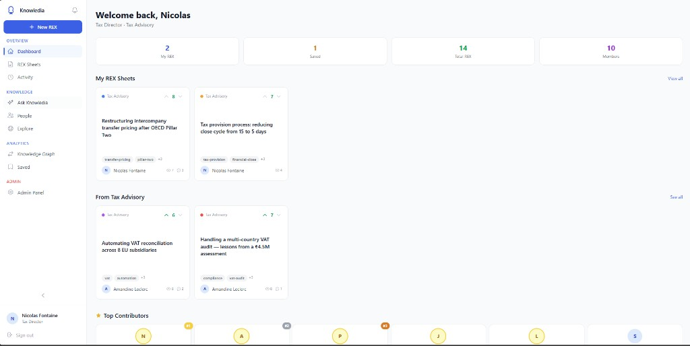
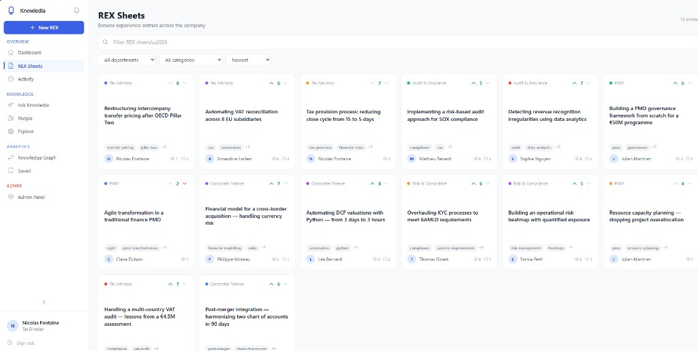
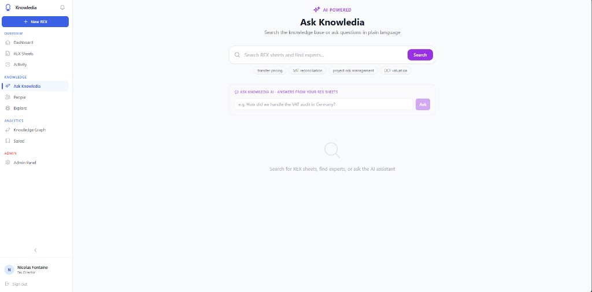
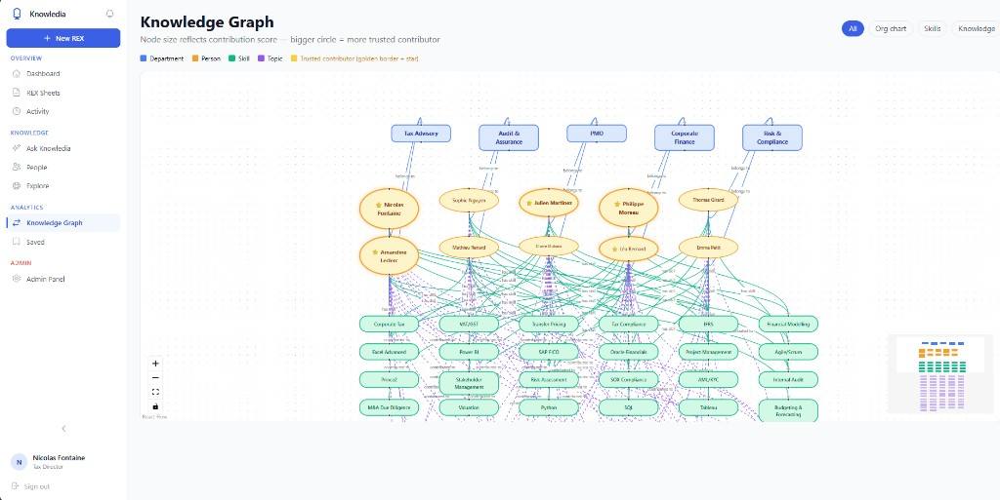

# Knowledia — Corporate Knowledge Management Platform

> The best useful knowledge management platform to keep the knowledge of people in a company and reuse it.

Knowledia is a self-contained, finance/tax/PMO-focused knowledge-sharing platform where employees save Return of Experience (REX) sheets, discover who owns what knowledge, and leverage AI to surface insights from accumulated organizational learning.

---

## Screenshots

### Dashboard


### REX Sheets Feed


### Ask Knowledia AI (RAG-powered)


### Knowledge Graph


---

## Quick Start

### Prerequisites

- Python 3.11+
- Node.js 20+

No Docker required — uses SQLite (zero config).

### 1. Configure environment

```bash
cp .env.example .env
# Edit SECRET_KEY and optionally LLM settings (see AI section below)
```

### 2. Start the backend

```bash
cd backend
pip install -r requirements.txt
python seed.py            # load demo data (10 users, 14 REX sheets, votes, comments)
uvicorn app.main:app --reload --port 8000
```

API docs: **http://localhost:8000/docs**

### 3. Start the frontend

```bash
cd frontend
npm install
npm run dev
```

Open **http://localhost:3000**

---

## Demo Accounts

After running `seed.py`, use any of these to log in:

| Name | Email | Password | Role |
|------|-------|----------|------|
| Nicolas Fontaine | `nicolas.fontaine@firma.eu` | `password` | Admin |
| Amandine Leclerc | `amandine.leclerc@firma.eu` | `password` | User |
| Sophie Nguyen | `sophie.nguyen@firma.eu` | `password` | User |
| Julien Martinez | `julien.martinez@firma.eu` | `password` | User |
| Philippe Moreau | `philippe.moreau@firma.eu` | `password` | User |
| Thomas Girard | `thomas.girard@firma.eu` | `password` | User |
| Léa Bernard | `lea.bernard@firma.eu` | `password` | User |
| Claire Dubois | `claire.dubois@firma.eu` | `password` | User |
| Emma Petit | `emma.petit@firma.eu` | `password` | User |
| Mathieu Renard | `mathieu.renard@firma.eu` | `password` | User |

---

## Features

### Core
- **REX Sheets** — Problem/solution format with tags, category, department
- **Voting system** — Upvote/downvote REX sheets; top-voted = trusted knowledge
- **Top Contributors** — Ranked by contribution score (votes + REX count)
- **Comments & Chat** — Discuss REX sheets with threaded comments/questions
- **Bookmarks** — Save REX sheets for later reference

### Discovery
- **Feed** — Browse all REX sheets with filters (department, category, date)
- **Search** — Full-text search across titles, content, and tags
- **Explore** — Browse by tags and departments
- **People** — Directory of team members with their expertise and REX sheets
- **Knowledge Graph** — Interactive visualization of people, skills, and departments; node size reflects contribution score

### AI (RAG-powered)
- **Ask Knowledia** — Conversational Q&A grounded strictly in your REX sheets
- **Smart suggestions** — Tag suggestions, related REX sheets, expert finder
- **TL;DR summaries** — AI-generated summaries of long REX sheets

Supports **Ollama/Llama** (local), **OpenAI**, or any OpenAI-compatible API.

### Platform
- **Personalized dashboard** — Your REX sheets, department activity, recommendations
- **Notifications + Activity** — Real-time notifications and platform activity feed in one panel
- **Profile pages** — Per-user REX sheets, contribution score, follow system
- **Drafts & versioning** — Save REX sheet drafts before publishing
- **Admin dashboard** — User management, platform stats
- **Responsive design** — Works on desktop, tablet, and mobile

---

## AI / LLM Configuration

Edit `.env` to enable AI features:

```env
# Use Ollama (local Llama) — recommended for privacy
LLM_PROVIDER=llama
LLM_BASE_URL=http://localhost:11434/v1
LLM_MODEL=llama3.2
LLM_API_KEY=ollama

# Or use OpenAI
# LLM_PROVIDER=openai
# LLM_API_KEY=sk-...
# LLM_MODEL=gpt-4o-mini

# Disable AI (heuristic fallback only)
# LLM_PROVIDER=none
```

To run Ollama locally: download from [ollama.com](https://ollama.com), then `ollama pull llama3.2`.

---

## Tech Stack

| Component | Technology |
|-----------|------------|
| Backend | FastAPI (Python 3.11) |
| Frontend | Next.js 14 + React + Tailwind CSS |
| Database | SQLite via SQLAlchemy + aiosqlite |
| Auth | JWT (python-jose) |
| Graph | ReactFlow |
| AI | Ollama / OpenAI-compatible LLM |

---

## Project Structure

```
knowledge-graph/
├── backend/
│   ├── app/
│   │   ├── main.py              # FastAPI entry point + CORS
│   │   ├── config.py            # Settings (SQLite path, JWT, LLM)
│   │   ├── auth.py              # JWT + password hashing
│   │   ├── llm.py               # LLM abstraction (Ollama / OpenAI / heuristic)
│   │   ├── models/
│   │   │   └── schemas.py       # Pydantic request/response schemas
│   │   ├── api/
│   │   │   ├── deps.py          # Auth dependencies
│   │   │   ├── auth.py          # POST /register, /login, GET /me
│   │   │   ├── learnings.py     # REX CRUD + vote + comment
│   │   │   ├── users.py         # Profiles + follow system
│   │   │   ├── tags.py          # Topic browsing
│   │   │   ├── bookmarks.py     # Save/unsave
│   │   │   ├── notifications.py # Notification feed
│   │   │   ├── activity.py      # Platform activity stream
│   │   │   ├── ai.py            # RAG chat, search, summaries, tag suggestions
│   │   │   └── admin.py         # Admin endpoints
│   │   └── db/
│   │       ├── postgres.py      # SQLite engine + session
│   │       └── models.py        # ORM models
│   ├── seed.py                  # Demo data loader
│   └── requirements.txt
├── frontend/
│   └── src/
│       ├── app/
│       │   ├── layout.tsx
│       │   ├── page.tsx              # Landing / sign-in
│       │   ├── dashboard/
│       │   ├── feed/                 # REX Sheets browser
│       │   ├── search/               # Ask Knowledia AI
│       │   ├── graph/                # Knowledge graph
│       │   ├── explore/
│       │   ├── people/
│       │   ├── bookmarks/
│       │   ├── admin/
│       │   ├── learnings/
│       │   │   ├── new/
│       │   │   └── [id]/edit/
│       │   └── users/[id]/
│       ├── components/
│       │   ├── Sidebar.tsx           # Persistent left nav + notification panel
│       │   ├── AppShell.tsx          # Authenticated layout wrapper
│       │   ├── RexCard.tsx           # Minimalist square card
│       │   ├── RexDialog.tsx         # Full REX detail + comments modal
│       │   └── KnowlediaLogo.tsx     # Brand logo component
│       └── lib/
│           ├── api.ts               # Backend API client
│           ├── AuthContext.tsx       # Auth state
│           ├── SidebarContext.tsx    # Sidebar collapse / mobile state
│           └── useMediaQuery.ts     # Responsive hook
├── .env.example
└── README.md
```

---

## Key API Endpoints

| Method | Path | Auth | Description |
|--------|------|------|-------------|
| POST | `/api/auth/register` | No | Create account |
| POST | `/api/auth/login` | No | Sign in, get JWT |
| GET | `/api/auth/me` | Yes | Current user profile |
| GET | `/api/learnings` | Optional | List REX sheets (search, filter) |
| POST | `/api/learnings` | Yes | Create a REX sheet |
| POST | `/api/learnings/{id}/vote` | Yes | Upvote / downvote |
| GET | `/api/learnings/{id}/comments` | Optional | Get comments |
| POST | `/api/learnings/{id}/comments` | Yes | Add comment |
| GET | `/api/users` | No | People directory |
| GET | `/api/users/{id}` | No | User profile + stats |
| POST | `/api/users/{id}/follow` | Yes | Follow a user |
| GET | `/api/notifications` | Yes | Your notifications |
| GET | `/api/activity` | Yes | Platform activity stream |
| POST | `/api/ai/chat` | Yes | RAG-powered Q&A |
| POST | `/api/ai/summarize/{id}` | Yes | Generate TL;DR |
| GET | `/api/bookmarks` | Yes | Your bookmarked REX sheets |
| GET | `/api/admin/stats` | Admin | Platform statistics |
